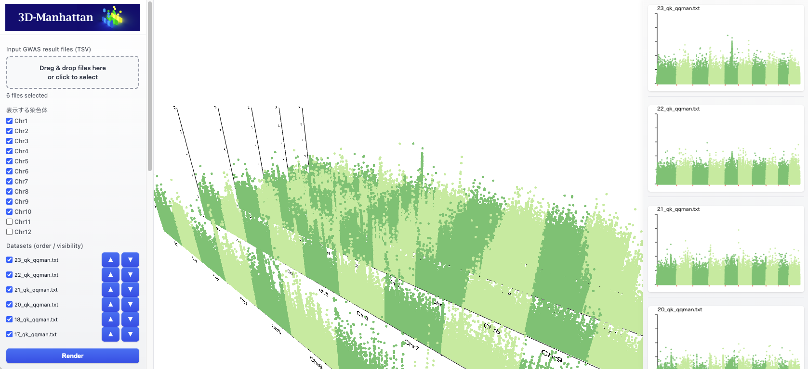

  

# Let's render your Manhattan plots in 3D space !
3D-Manhattan, an interactive visualization framework that integrates multiple GWAS results within a unified three-dimensional (3D) coordinate system. By extending the conventional Manhattan plot with an additional axis representing time, trait, or condition, 3D-Manhattan enables simultaneous, axis-aligned comparison of association landscapes while preserving genomic coordinates and statistical values. Implemented as a browser-based, stand-alone tool using WebGL-based rendering, 3D-Manhattan supports smooth interaction without server-side computation. The framework provides flexible visualization controls, region highlighting, and variant-level correspondence across datasets, facilitating exploratory analysis of stable and context-dependent genetic associations. Collectively, 3D-Manhattan addresses a key limitation of conventional GWAS visualization and offers a generalizable approach for multi-dimensional association data analysis.

### Citation
Hashimoto (2026), in preparing.

  

# How to use ?
3D-Manhattan accept following format;
| SNP    | CHR |   BP |         P |
|:--------|:---:|:-----:|:----------:|
| 1_1023 |  1  | 1023 | 0.90 |
| 1_1024 |  1  | 1024 | 1.08 |
| 1_1060 |  1  | 1060 | 0.27 |
| 1_1061 |  1  | 1061 | 0.14 |
| 1_1151 |  1  | 1151 | 0.30 |
| 1_6444 |  1  | 6444 | 1.64 |
| 1_6918 |  1  | 6918 | 0.35 |

After uploading the data, simply click the `Render` button to run the visualization.
